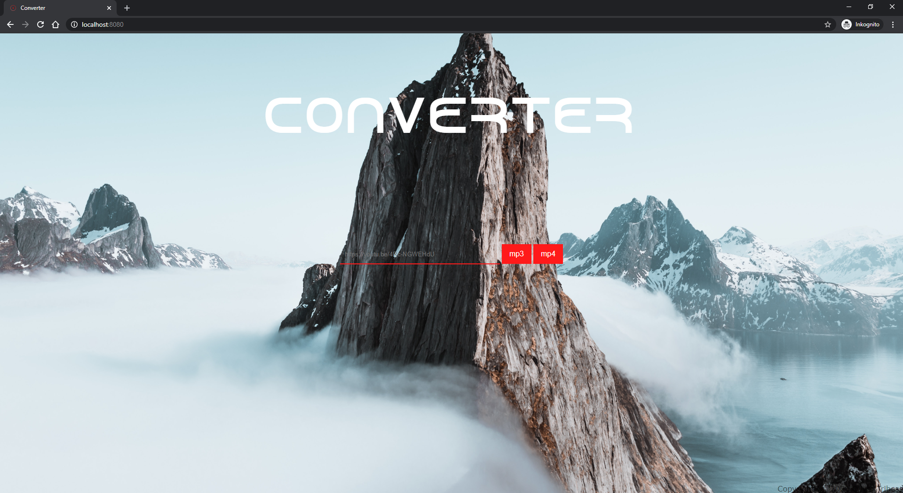

# converter
[](https://github.com/Tait1337/converter/actions)
[](https://sonarcloud.io/dashboard?id=Tait1337_converter)
[](LICENSE)

Online YouTube2Mp3 converter. Download online videos as mp3 (audio) or mp4 (video).

## Getting Started

These instructions will get you a copy of the project up and running on your local machine for development and testing purposes. See deployment for notes on how to deploy the project on a live system.

### Prerequisites

No Prerequisites.

### Installing

Clone the Repository.
```
git clone https://github.com/tait1337/converter.git
```

Navigate to ./Index.html.



### Configuration

No Configuration exist.

## Running the tests

No Tests exist.

## Deployment

The most basic option to run the Application is as Dockerimage with included Web Server and required convertion programs.

### Built and run as Dockerimage

```
./docker build -t converter:latest .
./docker run --env-file .env -p 8080:8080 -d converter:latest
```

## Contributing

I encourage all the developers out there to contribute to the repository and help me to update or expand it.

To contribute just create an issue together with the pull request that contains your features or fixes.

## Versioning

We use [GitHub](https://github.com/) for versioning. For the versions available, see the [tags on this repository](https://github.com/tait1337/converter/tags). 

## Authors

* **Oliver Tribess** - *Initial work* - [tait1337](https://github.com/tait1337)

## License

This project is licensed under the Apache License 2.0 - see the [LICENSE](LICENSE) file for details.

Please note that according to [§ 53 Absatz 1 UrhG](http://www.gesetze-im-internet.de/urhg/__53.html), creating copies are only allowed for private, non-commercial use. The regulations may differ in country and Streaming Platform.

## Acknowledgments

* [Youtube-dl](https://youtube-dl.org/) - the command-line program to download videos from [YouTube.com](https://www.youtube.com/) and a few [more sites](http://ytdl-org.github.io/youtube-dl/supportedsites.html)
* [FFmpeg](https://ffmpeg.org/) - the cross-platform solution to record, convert and stream audio and video
* Photographer of Background Photos from [Pexels](https://www.pexels.com/)
